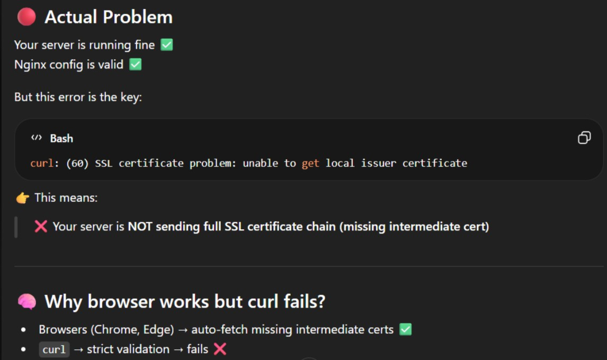
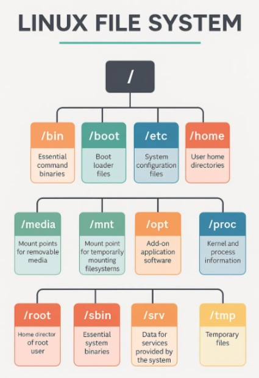
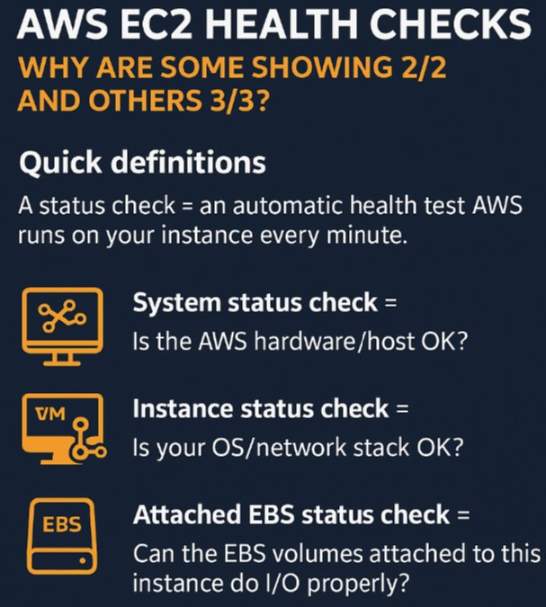
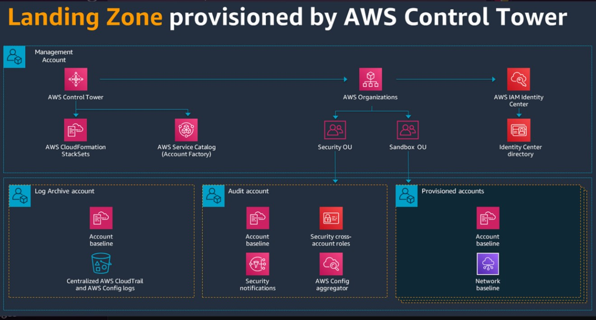

redhat has some issues, run below commands to switch to us-east-2 <br>
```hcl
cd /etc/yum.repos.d/
sed -i 's/REGION/us-east-2/g' redhat-rhui.repo redhat-rhui-client-config.repo
```
===================================== <br>
This is Full-chain SSL certificate issue. <br>
 <br>
 <br>
Some legacy application s facing these type of issues also, We can present this issue also in interviews <br>
===================================== <br>
**Kubernetes Interview Questions: Real vs Padded Answers** <br>
&emsp;1.&emsp; **Resume says: "Managed Kubernetes clusters"**<br>
*Interview question:* <br>
"Walk me through what happens when a node goes NotReady."<br><br>
Real answer:<br>
"First I check kubectl get nodes to confirm the state.
Then kubectl describe node to see conditions —
MemoryPressure, DiskPressure, PIDPressure tell me why.
If it's a network issue the node just disappears from the list.
I cordon the node immediately so no new pods schedule there,
check if existing pods are rescheduling correctly,
then investigate kubelet logs on the node itself.
sudo journalctl -u kubelet -f
That tells me if it's a resource issue, a network issue,
or kubelet crashed entirely."<br><br>
*Padded answer:* "I would restart the node."<br><br>
&emsp;2.&emsp; **Resume says: "Deployed microservices on Kubernetes"**<br><br>
*Interview question:*<br>
"How do you do zero downtime deployments?"<br><br>
*Real answer:*<br>
"RollingUpdate strategy with maxUnavailable: 0
and maxSurge: 1 in the deployment spec.
But that alone isn't enough —
you need readinessProbe configured correctly.
If your readinessProbe is wrong, Kubernetes thinks
the new pod is ready before it actually is.
Traffic hits it. Users get errors.
Zero downtime on paper. Downtime in production."<br><br>
*Padded answer:* "Kubernetes handles it automatically."<br><br>
&emsp;3.&emsp; **Resume says: "Optimized Kubernetes resource utilization"**<br><br>
*Interview question:*<br>
"What's the difference between requests and limits?"<br><br>
*Real answer:*<br>
"Requests = what the scheduler uses to place the pod.
Limits = the hard ceiling the container cannot cross.
If you set limits without requests —
Kubernetes uses the limit as the request.
Your pods get placed on nodes that can't actually handle them.
OOMKilled at 2AM. Every time.
I always set both. Requests at 70% of expected usage.
Limits at 130%. Buffer on both sides."<br><br>
*Padded answer:* "Requests is minimum, limits is maximum."

===================================== <br>
I SSHed into my first Linux server and typed `ls`.<br><br>
Saw /etc, /var, /usr, /opt, /proc…<br><br>
I had no idea what any of it meant.<br>
I just knew which commands to run — not WHY things were where they were.<br><br>
That gap cost me time in every production incident.<br><br>
Here's what I wish someone told me on Day 1:<br><br>
Linux directories are not random folders.<br><br>
They are a carefully designed operating system architecture.<br><br>
Once you understand the design — troubleshooting becomes 10x faster.<br><br>
The ones that matter most in DevOps:<br><br>
`/etc` → Every config file lives here<br>
   nginx, sshd, cron, systemd — all configured from `/etc`<br>
   "Server behaving weird?" — check here first.<br><br>
`/var` → Everything that grows over time<br>
   Logs, cache, spool, runtime data<br>
   "Disk at 100%?" — 90% of the time it's /var/log<br>
   du -sh /var/log/* — find the culprit in seconds<br><br>
`/proc` → Not a real folder — it's the kernel talking to you<br>
    cat /proc/meminfo → real-time memory<br>
    cat /proc/cpuinfo → CPU details<br>
    No disk write happens here. It's live kernel data.<br><br>
`/tmp` → Temporary files — cleared on reboot<br>
   Apps dump here thinking it's safe<br>
   In production, monitor this. It fills up silently.<br><br>
`/opt` → Where you install custom/third-party software<br>
   Jenkins, custom agents, enterprise tools — they go here<br>
   Keeps /usr clean and organized<br><br>
`/boot` → Touch this only if you know exactly what you're doing<br>
    Bootloader + kernel images live here<br>
    One wrong move = server won't start<br><br>
`/bin` & `/sbin` → Survival toolkit<br>
        If these break — nothing works<br>
        ls, cp, mv, systemctl all live here<br><br>
*Real incident I remember:*<br>
2AM. Application down. Disk full alert firing.<br>
Went straight to /var/log — application was logging every single DB query in debug mode.<br>
Log file was 47GB.<br><br>
Truncated the log → disk freed → service recovered.<br>
Total time: 6 minutes.<br><br>
Without knowing the file system — I would have been guessing.<br>
 <br>
===================================== <br>
&emsp;1.&emsp;**Q. What is your recent achievement like, How you fixed your recent facing issue's??**<br><br>
A: Investigated the filesystem mounting issue and identified an incorrect configuration <br>in `/etc/fstab`. Validated mount entries, corrected the configuration, tested using <br> `mount -a`, and confirmed successful filesystem mounting. Issue resolved successfully.<br><br>
&emsp;2.&emsp;**Q. Why AWS EC2 having 3/3 checks??**<br><br>
 <br>
===================================== <br>
**AWS LandingZone Architecture**<br><br>
 <br>
===================================== <br>